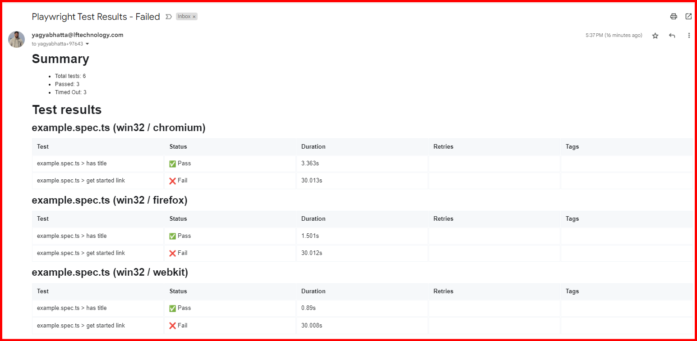

# Playwright Email Integration

This project integrates the Playwright testing framework with the `playwright-mail-reporter` to send email reports after running tests. It allows for easy configuration of SMTP settings.

## Table of Contents

- [Features](#features)
- [Requirements](#requirements)
- [Installation](#installation)
- [Configuration](#configuration)
- [Usage](#usage)
- [Running Tests](#running-tests)
- [Environment Variables](#environment-variables)
- [Contributing](#contributing)
- [License](#license)

## Features

- Cross-browser testing using Playwright (Chromium, Firefox, WebKit).
- Generates HTML reports for test results.
- Sends test results via email.
- Configurable SMTP settings using environment variables.

## Requirements

- Node.js (>= 14.x)
- npm (Node package manager)

## Installation

1. Clone the repository:

   ```bash
   git clone using SSH: <git@github.com:lfyagya/Playwright-Email-Integration.git>
   cd Playwright-Email-Integration

2. Install dependencies:
    ```bash
    npm install

## Configuration
The Playwright configuration file: `playwright.config.js` is responsible for setting up the testing environment and configuring the email reporter.

## Usage
This project includes the `playwright-mail-reporter` that automatically sends an email with the test results after execution. The configuration for this reporter is done in the reporter section of `playwright.config.js`.

## Running Tests
To execute the tests, run the following command in your terminal:
    ```bash
    npx playwright test

## Environment Variables
You must create a `.env` file in the root of your project directory to store your SMTP configuration. Below is a sample .env file template:
    ```bash
    SMTP_HOST=smtp.example.com        # Your SMTP server
    SMTP_PORT=465                     # Your SMTP port
    SMTP_USER=your_username            # Your SMTP username
    SMTP_PASS=your_password            # Your SMTP password
    SENDER_EMAIL=sender@example.com    # Email address from which to send
    RECIPIENT_EMAIL=recipient@example.com # Comma-separated list of recipient emails

## Screenshot

